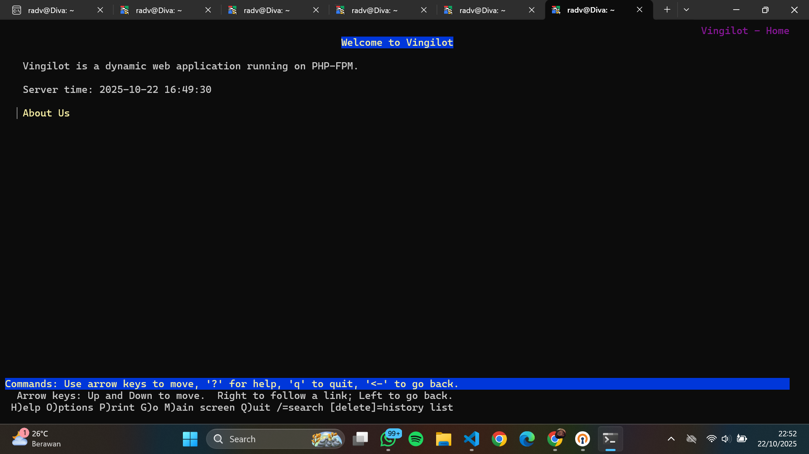

# Jarkom-Modul-2-2025-K46
===========[Kelompok 46]=============

Mutiara Diva Jaladitha - 5027241083

Abiyyu Raihan Putra Wikanto - 5027241042

============[PENJELASAN SOAL]=============
## soal_1 
_"Di tepi Beleriand yang porak-poranda, Eonwe merentangkan tiga jalur: Barat untuk Earendil dan Elwing, Timur untuk Círdan, Elrond, Maglor, serta pelabuhan DMZ bagi Sirion, Tirion, Valmar, Lindon, Vingilot. Tetapkan alamat dan default gateway tiap tokoh sesuai glosarium yang sudah diberikan."_
### Langkah pengerjaan

## soal_2
_"Angin dari luar mulai berhembus ketika Eonwe membuka jalan ke awan NAT. Pastikan jalur WAN di router aktif dan NAT meneruskan trafik keluar bagi seluruh alamat internal sehingga host di dalam dapat mencapai layanan di luar menggunakan IP address"._
### Langkah pengerjaan

## soal_3 
_"Kabar dari Barat menyapa Timur. Pastikan kelima klien dapat saling berkomunikasi lintas jalur (routing internal via Eonwe berfungsi), lalu pastikan setiap host non-router menambahkan resolver 192.168.122.1 saat interfacenya aktif agar akses paket dari internet tersedia sejak awal."_
### Langkah pengerjaan

## soal_4 
_"Para penjaga nama naik ke menara, di Tirion (ns1/master) bangun zona <xxxx>.com sebagai authoritative dengan SOA yang menunjuk ke ns1.<xxxx>.com dan catatan NS untuk ns1.<xxxx>.com dan ns2.<xxxx>.com. Buat A record untuk ns1.<xxxx>.com dan ns2.<xxxx>.com yang mengarah ke alamat Tirion dan Valmar sesuai glosarium, serta A record apex <xxxx>.com yang mengarah ke alamat Sirion (front door), aktifkan notify dan allow-transfer ke Valmar, set forwarders ke 192.168.122.1. Di Valmar (ns2/slave) tarik zona <xxxx>.com dari Tirion dan pastikan menjawab authoritative. pada seluruh host non-router ubah urutan resolver menjadi IP dari ns1.<xxxx>.com → ns2.<xxxx>.com → 192.168.122.1. Verifikasi query ke apex dan hostname layanan dalam zona dijawab melalui ns1/ns2."_
### Langkah pengerjaan

## soal_5 
_"“Nama memberi arah,” kata Eonwe. Namai semua tokoh (hostname) sesuai glosarium, eonwe, earendil, elwing, cirdan, elrond, maglor, sirion, tirion, valmar, lindon, vingilot, dan verifikasi bahwa setiap host mengenali dan menggunakan hostname tersebut secara system-wide. Buat setiap domain untuk masing masing node sesuai dengan namanya (contoh: eru.<xxxx>.com) dan assign IP masing-masing juga. Lakukan pengecualian untuk node yang bertanggung jawab atas ns1 dan ns2_
### Langkah pengerjaan

"## soal_6 
_"Lonceng Valmar berdentang mengikuti irama Tirion. Pastikan zone transfer berjalan, Pastikan Valmar (ns2) telah menerima salinan zona terbaru dari Tirion (ns1). Nilai serial SOA di keduanya harus sama"_
### Langkah pengerjaan

## soal_7 
_"Peta kota dan pelabuhan dilukis. Sirion sebagai gerbang, Lindon sebagai web statis, Vingilot sebagai web dinamis. Tambahkan pada zona <xxxx>.com A record untuk sirion.<xxxx>.com (IP Sirion), lindon.<xxxx>.com (IP Lindon), dan vingilot.<xxxx>.com (IP Vingilot). Tetapkan CNAME :
www.<xxxx>.com → sirion.<xxxx>.com, 
static.<xxxx>.com → lindon.<xxxx>.com, dan 
app.<xxxx>.com → vingilot.<xxxx>.com. 
Verifikasi dari dua klien berbeda bahwa seluruh hostname tersebut ter-resolve ke tujuan yang benar dan konsisten."_
### Langkah pengerjaan

## soal_8 
_"Setiap jejak harus bisa diikuti. Di Tirion (ns1) deklarasikan satu reverse zone untuk segmen DMZ tempat Sirion, Lindon, Vingilot berada. Di Valmar (ns2) tarik reverse zone tersebut sebagai slave, isi PTR untuk ketiga hostname itu agar pencarian balik IP address mengembalikan hostname yang benar, lalu pastikan query reverse untuk alamat Sirion, Lindon, Vingilot dijawab authoritative."_
### Langkah pengerjaan

## soal_9 
_"Lampion Lindon dinyalakan. Jalankan web statis pada hostname static.<xxxx>.com dan buka folder arsip /annals/ dengan autoindex (directory listing) sehingga isinya dapat ditelusuri. Akses harus dilakukan melalui hostname, bukan IP."_
### Langkah pengerjaan

## soal_10 
_"Vingilot mengisahkan cerita dinamis. Jalankan web dinamis (PHP-FPM) pada hostname app.<xxxx>.com dengan beranda dan halaman about, serta terapkan rewrite sehingga /about berfungsi tanpa akhiran .php. Akses harus dilakukan melalui hostname."_
### Langkah pengerjaan

## soal_11

"_Di muara sungai, Sirion berdiri sebagai reverse proxy. Terapkan path-based routing: /static → Lindon dan /app → Vingilot, sambil meneruskan header Host dan X-Real-IP ke backend. Pastikan Sirion menerima www.<xxxx>.com (kanonik) dan sirion.<xxxx>.com, dan bahwa konten pada /static dan /app di-serve melalui backend yang tepat._"

Soal_11.sh dijalankan di Sirion
    #!/bin/bash
    
    # Instalasi Nginx
    apt update
    apt install nginx -y
    
    # Konfigurasi Nginx sebagai reverse proxy
    # Menggunakan 'cat <<EOF >' adalah cara scripting untuk menulis file multiline
    cat <<EOF > /etc/nginx/sites-available/K46.com
    server {
        listen 80;
        server_name www.K46.com sirion.K46.com;
    
        # Meneruskan header penting ke server backend
        proxy_set_header Host \$host;
        proxy_set_header X-Real-IP \$remote_addr;
        proxy_set_header X-Forwarded-For \$proxy_add_x_forwarded_for;
        proxy_set_header X-Forwarded-Proto \$scheme;
    
        # Aturan untuk path /static
        location /static/ {
            proxy_pass http://192.234.3.5/;
        }
    
        # Aturan untuk path /app
        location /app/ {
            proxy_pass http://192.234.3.6/;
        }
    }
    EOF
    
    # Aktifkan site dan restart Nginx
    ln -sf /etc/nginx/sites-available/K46.com /etc/nginx/sites-enabled/
    rm -f /etc/nginx/sites-enabled/default
    service nginx restart
    
    echo "Konfigurasi reverse proxy untuk Soal 11 selesai."

Pada awalnya menggunakan autoscript ini, saya mendapatkan kendala berupa tidak bisa terkoneksi dengan internet. Ketika mencoba ping 8.8.8.8 dan ping google.com hasilnya . Namun masalah berhasil hilang dengan menggunakan berikut sehingga bisa terkoneksi dengan internet :
    apt update 
    apt install iptables 
    iptables -t nat -A POSTROUTING -o eth0 -j MASQUERADE -s 192.234.0.0/16

Soal_11_fix.sh dijalankan di Sirion

    #!/bin/bash
    set -e
    
    # Soal 11 - Sirion (reverse proxy, canonical redirect, basic auth /admin, forward original IP)
    # Jalankan di node Sirion (IP: 192.234.3.2 menurut soal)
    
    # update & install
    apt update
    apt install -y nginx apache2-utils
    
    # set website content for Sirion (front page)
    mkdir -p /var/www/www.K46.com
    cat > /var/www/www.K46.com/index.html <<'HTML'
    <!doctype html>
    <html>
    <head>
      <meta charset="utf-8">
      <title>War of Wrath: Lindon bertahan</title>
    </head>
    <body>
      <h1>War of Wrath: Lindon bertahan</h1>
      
Selamat datang — tautan:

      <ul>
        <li><a href="/static/">Static (Lindon)</a></li>
        <li><a href="/app/">App (Vingilot)</a></li>
      </ul>
    </body>
    </html>
    HTML
    
    # buat halaman admin (dilindungi)
    mkdir -p /var/www/www.K46.com/admin
    cat > /var/www/www.K46.com/admin/index.html <<'HTML'
    <!doctype html>
    <html>
    <head><meta charset="utf-8"><title>Admin</title></head>
    <body>
    <h1>Admin area - Sirion</h1>
    
Area ini terlindungi Basic Auth.

    </body>
    </html>
    HTML
    
    # buat credential basic auth
    # Username: admin | Password: K46admin  (ubah bila perlu)
    htpasswd_file="/etc/nginx/.htpasswd"
    if [ -f "$htpasswd_file" ]; then
      htpasswd -b "$htpasswd_file" admin K46admin
    else
      htpasswd -b -c "$htpasswd_file" admin K46admin
    fi
    chmod 640 "$htpasswd_file"
    chown root:www-data "$htpasswd_file"
    
    # Buat konfigurasi nginx untuk canonical host, redirect default, dan proxying path-based
    # Server yang menerima canonical (www.K46.com) akan mem-proxy /static ke Lindon (192.234.3.5)
    # dan /app ke Vingilot (192.234.3.6). /admin dilindungi Basic Auth (di Sirion, bukan di backend).
    
    # 1) Default server -> redirect ke canonical
    cat > /etc/nginx/sites-available/00_redirect_to_www <<'NGINX'
    server {
        listen 80 default_server;
        server_name _;
        return 301 http://www.K46.com$request_uri;
    }
    NGINX
    
    # 2) sirion.K46.com -> redirect ke canonical (301)
    cat > /etc/nginx/sites-available/01_sirion_redirect <<'NGINX'
    server {
        listen 80;
        server_name sirion.K46.com;
        return 301 http://www.K46.com$request_uri;
    }
    NGINX
    
    # 3) canonical server: www.K46.com (melayani frontpage + proxy /static & /app)
    cat > /etc/nginx/sites-available/www.K46.com <<'NGINX'
    server {
        listen 80;
        server_name www.K46.com;
    
        access_log /var/log/nginx/www.K46.access.log;
        error_log /var/log/nginx/www.K46.error.log;
    
        # Front page lokal (index)
        root /var/www/www.K46.com;
        index index.html;
    
        # Halaman utama
        location = / {
            try_files /index.html =404;
        }
    
        # Basic Auth area (lokal di Sirion)
        location ^~ /admin {
            auth_basic "Admin Area";
            auth_basic_user_file /etc/nginx/.htpasswd;
            try_files /admin/index.html =404;
        }
    
        # Static -> Lindon (static.K46.com) 
        # Pastikan backend menerima Host header static.K46.com agar vhost di Lindon ter-trigger
        location /static/ {
            proxy_pass         http://192.234.3.5:80/;
            proxy_set_header   Host static.K46.com;
            proxy_set_header   X-Real-IP $remote_addr;
            proxy_set_header   X-Forwarded-For $proxy_add_x_forwarded_for;
            proxy_set_header   X-Forwarded-Proto $scheme;
            proxy_http_version 1.1;
            proxy_set_header   Connection "";
        }
    
        # App -> Vingilot (app.K46.com)
        location /app/ {
            proxy_pass         http://192.234.3.6:80/;
            proxy_set_header   Host app.K46.com;
            proxy_set_header   X-Real-IP $remote_addr;
            proxy_set_header   X-Forwarded-For $proxy_add_x_forwarded_for;
            proxy_set_header   X-Forwarded-Proto $scheme;
            proxy_http_version 1.1;
            proxy_set_header   Connection "";
        }
    
        # Jika ada request langsung ke IP atau host lain, default server menangani dan redirect ke www (lihat 00_redirect_to_www)
    }
    NGINX
    
    # Enable sites
    ln -fs /etc/nginx/sites-available/00_redirect_to_www /etc/nginx/sites-enabled/00_redirect_to_www
    ln -fs /etc/nginx/sites-available/01_sirion_redirect /etc/nginx/sites-enabled/01_sirion_redirect
    ln -fs /etc/nginx/sites-available/www.K46.com /etc/nginx/sites-enabled/www.K46.com
    
    # Remove default if exists
    rm -f /etc/nginx/sites-enabled/default
    
    # Pastikan permissions
    chown -R www-data:www-data /var/www/www.K46.com
    
    # Restart nginx (validasi konfigurasi terlebih dahulu)
    nginx -t
    systemctl reload nginx
    
    echo "Soal 11 (Sirion) selesai. - frontpage, /static -> 192.234.3.5, /app -> 192.234.3.6"
    echo "Admin credentials: admin / K46admin"

## soal_12

"_Ada kamar kecil di balik gerbang yakni /admin. Lindungi path tersebut di Sirion menggunakan Basic Auth, akses tanpa kredensial harus ditolak dan akses dengan kredensial yang benar harus diizinkan._"

soal_12.sh dijalankan di Tirion

    #!/bin/bash
    set -e
    DOMAIN="K46.com"
    ZONEFILE="/etc/bind/zones/db.${DOMAIN}"
    REVZONE="3.234.192.in-addr.arpa"
    REVFILE="/etc/bind/zones/db.192.234.3"
    
    apt update
    apt install -y bind9 dnsutils
    
    mkdir -p /etc/bind/zones
    
    cat > /etc/bind/named.conf.local <<EOF
    zone "${DOMAIN}" {
        type master;
        file "${ZONEFILE}";
        allow-transfer { 192.234.3.4; };
        notify yes;
        also-notify { 192.234.3.4; };
    };
    
    zone "${REVZONE}" {
        type master;
        file "${REVFILE}";
        allow-transfer { 192.234.3.4; };
        notify yes;
        also-notify { 192.234.3.4; };
    };
    EOF
    
    # create zone file (SOA serial uses YYYYMMDDnn)
    SERIAL=$(date +%Y%m%d)01
    cat > "${ZONEFILE}" <<EOF
    \$TTL 30
    @   IN  SOA ns1.${DOMAIN}. root.${DOMAIN}. (
            ${SERIAL}    ; Serial
            604800       ; Refresh
            86400        ; Retry
            2419200      ; Expire
            30 )         ; Negative Cache TTL
    
    ; NS
    @       IN  NS      ns1.${DOMAIN}.
    @       IN  NS      ns2.${DOMAIN}.
    
    ; A records
    ns1     IN  A       192.234.3.3
    ns2     IN  A       192.234.3.4
    sirion  IN  A       192.234.3.2
    lindon  IN  A       192.234.3.5
    vingilot IN A      192.234.3.6
    
    ; CNAMEs
    www     IN  CNAME   sirion.${DOMAIN}.
    static  IN  CNAME   lindon.${DOMAIN}.
    app     IN  CNAME   vingilot.${DOMAIN} 
    EOF
    
    cat > "${REVFILE}" <<EOF
    \$TTL 30
    @   IN  SOA ns1.${DOMAIN}. root.${DOMAIN}. (
            ${SERIAL}
            604800
            86400
            2419200
            30 )
    
    @       IN  NS ns1.${DOMAIN}.
    @       IN  NS ns2.${DOMAIN}.
    
    2       IN PTR sirion.${DOMAIN}.
    5       IN PTR lindon.${DOMAIN}.
    6       IN PTR vingilot.${DOMAIN}.
    EOF
    
    # Restart bind9
    service bind9 restart || /etc/init.d/bind9 restart
    
    echo "Tirion (ns1) configured. Zone file serial: ${SERIAL}"

Ditemukan bahwa soal_12.sh masih belum sesuai dengan soal, sehingga ditambahkan lagi melalui soal_12fix.sh :

    #!/bin/bash
    set -euo pipefail
    
    LOGDIR="/var/log/bind"
    NAMED_BIN="/usr/sbin/named"
    NAMED_CONF="/etc/bind/named.conf"
    ZONEDIR="/etc/bind/zones"
    
    echo "== soal_12fix: mulai =="
    mkdir -p "${LOGDIR}"
    chown bind:bind "${LOGDIR}" 2>/dev/null || true
    chmod 750 "${LOGDIR}" 2>/dev/null || true
    
    if [ ! -x "${NAMED_BIN}" ]; then
      echo "ERROR: binary named tidak ditemukan di ${NAMED_BIN}"
      exit 1
    fi
    if [ ! -f "${NAMED_CONF}" ]; then
      echo "ERROR: konfigurasi ${NAMED_CONF} tidak ditemukan"
      exit 1
    fi
    
    echo "-- menjalankan named-checkconf"
    if ! named-checkconf; then
      echo "named-checkconf GAGAL - periksa /etc/bind/named.conf"
      exit 1
    fi
    
    if [ -d "${ZONEDIR}" ]; then
      for f in "${ZONEDIR}"/*; do
        [ -f "$f" ] || continue
        base=$(basename "$f")
        if [[ "$base" =~ ^db\.([0-9]+\.) ]]; then
          zone="3.234.192.in-addr.arpa"
        else
          zone="${base#db.}"
        fi
        echo "-- validasi zone ${zone} (${f})"
        if ! named-checkzone "${zone}" "$f"; then
          echo "named-checkzone GAGAL untuk zone ${zone}, file ${f}"
          exit 1
        fi
      done
    fi
    
    # hentikan named lama jika ada
    if pgrep -x named >/dev/null 2>&1; then
      echo "-- menghentikan proses named yang aktif"
      pkill -x named || true
      sleep 1
    fi
    
    : > "${LOGDIR}/named.out" 2>/dev/null || true
    chown bind:bind "${LOGDIR}/named.out" 2>/dev/null || true
    
    echo "-- menjalankan named (foreground) -> ${LOGDIR}/named.out"
    setsid "${NAMED_BIN}" -u bind -c "${NAMED_CONF}" -g > "${LOGDIR}/named.out" 2>&1 &
    
    # tunggu hingga named muncul (cek sampai 10 kali, 0.5s interval)
    started=0
    for i in $(seq 1 10); do
      sleep 0.5
      if pidof named >/dev/null 2>&1 || pgrep -x named >/dev/null 2>&1; then
        started=1
        break
      fi
    done
    
    # fallback: cek kata 'running' di log
    if [ "$started" -eq 0 ]; then
      if grep -m1 -i 'running' "${LOGDIR}/named.out" >/dev/null 2>&1; then
        started=1
      fi
    fi
    
    if [ "$started" -eq 0 ]; then
      echo "ERROR: named tidak terdeteksi berjalan. Menampilkan ${LOGDIR}/named.out (tail 200):"
      tail -n 200 "${LOGDIR}/named.out" || true
      exit 1
    fi
    
    echo "   named terdeteksi berjalan (PID: $(pidof named || true))"
    
    echo ""
    echo "== tail named.out (last 80 lines) =="
    tail -n 80 "${LOGDIR}/named.out" || true
    
    echo ""
    echo "-- verifikasi singkat via dig (localhost)"
    dig @127.0.0.1 K46.com SOA +short || true
    dig @127.0.0.1 sirion.K46.com A +short || true
    dig @127.0.0.1 lindon.K46.com A +short || true
    dig @127.0.0.1 vingilot.K46.com A +short || true
    dig @127.0.0.1 -x 192.234.3.2 +short || true
    
    # buat /etc/rc.local untuk autostart pada image tanpa systemd
    if [ ! -f /etc/rc.local ]; then
      cat > /etc/rc.local <<'RC'
    #!/bin/sh -e
    if [ -x /usr/sbin/named ]; then
      pgrep named >/dev/null || setsid /usr/sbin/named -u bind -c /etc/bind/named.conf -g > /var/log/bind/named.out 2>&1 &
    fi
    exit 0
    RC
      chmod +x /etc/rc.local
      echo "-- /etc/rc.local dibuat untuk autostart named"
    else
      echo "-- /etc/rc.local sudah ada"
    fi
    
    echo ""
    echo "Selesai: Tirion menjalankan named."

## soal_13 

"_“Panggil aku dengan nama,” ujar Sirion kepada mereka yang datang hanya menyebut angka. Kanonisasikan endpoint, akses melalui IP address Sirion maupun sirion.<xxxx>.com harus redirect 301 ke www.<xxxx>.com sebagai hostname kanonik._"

soal_13.sh dijalankan di Valmor

    #!/bin/bash
    set -euo pipefail
    
    # soal_13.sh - konfigurasi dan start BIND sebagai slave (Valmar / ns2)
    MASTER="192.234.3.3"
    DOMAIN="K46.com"
    LOGDIR="/var/log/bind"
    NAMED_BIN="/usr/sbin/named"
    NAMED_CONF="/etc/bind/named.conf"
    
    # Paksa resolver sementara agar apt/dig ke master berhasil
    echo "nameserver ${MASTER}" > /etc/resolv.conf
    
    # Pastikan direktori log ada
    mkdir -p "${LOGDIR}"
    chown bind:bind "${LOGDIR}" 2>/dev/null || true
    chmod 750 "${LOGDIR}" 2>/dev/null || true
    
    # Tulis named.conf.local sebagai slave (overwrite agar konsisten)
    cat > /etc/bind/named.conf.local <<EOF
    zone "${DOMAIN}" {
      type slave;
      masters { ${MASTER}; };
      file "/var/lib/bind/db.${DOMAIN}";
      allow-notify { ${MASTER}; };
    };
    
    zone "3.234.192.in-addr.arpa" {
      type slave;
      masters { ${MASTER}; };
      file "/var/lib/bind/db.192.234.3";
      allow-notify { ${MASTER}; };
    };
    EOF
    
    # Pastikan direktori var lib bind ada
    mkdir -p /var/lib/bind
    chown bind:bind /var/lib/bind 2>/dev/null || true
    
    # Coba start service bind9 (jika environment mendukung)
    if command -v service >/dev/null 2>&1; then
      service bind9 start || true
    fi
    
    # Jika named belum berjalan, jalankan manual (foreground -> log)
    if ! pidof named >/dev/null 2>&1; then
      setsid "${NAMED_BIN}" -u bind -c "${NAMED_CONF}" -g > "${LOGDIR}/named.out" 2>&1 &
      sleep 2
    fi
    
    echo
    echo "=== tail ${LOGDIR}/named.out (jika ada) ==="
    tail -n 60 "${LOGDIR}/named.out" 2>/dev/null || true
    
    echo
    echo "=== Verifikasi dari master ==="
    dig @"${MASTER}" ${DOMAIN} SOA +short || true
    
    echo
    echo "=== Verifikasi lokal (Valmar) ==="
    dig @127.0.0.1 ${DOMAIN} SOA +short || true
    dig @127.0.0.1 ${DOMAIN} AXFR +short || true
    
    echo
    echo "Selesai. Jika AXFR belum terlihat, tunggu 5–10 detik lalu ulangi: dig @127.0.0.1 ${DOMAIN} AXFR +short"

## soal_14

"_Di Vingilot, catatan kedatangan harus jujur. Pastikan access log aplikasi di Vingilot mencatat IP address klien asli saat lalu lintas melewati Sirion (bukan IP Sirion)._"

soal_14.sh dijalankan di Lindon

    #!/bin/bash
    set -euo pipefail
    
    echo "== soal_14: konfigurasi web statis di Lindon =="
    
    DOMAIN="K46.com"
    WEBROOT="/var/www/www.${DOMAIN}/static"
    LOGDIR="/var/log/nginx"
    INDEXFILE="${WEBROOT}/index.html"
    
    # 1. Update repositori & install nginx
    echo "-- memastikan nginx terpasang"
    apt update -y >/dev/null 2>&1 || true
    apt install -y nginx >/dev/null 2>&1
    
    # 2. Buat direktori web
    echo "-- membuat direktori web di ${WEBROOT}"
    mkdir -p "${WEBROOT}"
    chown -R www-data:www-data /var/www/www.${DOMAIN}
    chmod -R 755 /var/www/www.${DOMAIN}
    
    # 3. Buat halaman index sederhana
    echo "-- menulis halaman index"
    cat > "${INDEXFILE}" <<EOF
    <!DOCTYPE html>
    <html>
    <head>
      <title>Static Page - K46</title>
      
    </head>
    <body>
      <h1>Welcome to Lindon Static Web Server</h1>
      
Server: Lindon (192.234.3.5)

      
This is the static page for <b>www.K46.com/static</b>.

    </body>
    </html>
    EOF
    
    # 4. Buat konfigurasi virtual host
    echo "-- menulis konfigurasi virtual host Nginx"
    cat > /etc/nginx/sites-available/www.${DOMAIN} <<EOF
    server {
        listen 80;
        server_name www.${DOMAIN};
    
        access_log ${LOGDIR}/www.${DOMAIN}.access.log;
        error_log ${LOGDIR}/www.${DOMAIN}.error.log;
    
        location /static {
            root /var/www/www.${DOMAIN};
            index index.html;
        }
    }
    EOF
    
    # 5. Aktifkan konfigurasi
    ln -sf /etc/nginx/sites-available/www.${DOMAIN} /etc/nginx/sites-enabled/www.${DOMAIN}
    rm -f /etc/nginx/sites-enabled/default
    
    # 6. Uji konfigurasi dan restart nginx
    echo "-- menguji konfigurasi Nginx"
    nginx -t
    systemctl restart nginx || service nginx restart
    
    # 7. Tampilkan status dan uji curl
    echo "-- status nginx"
    ps aux | grep nginx | grep -v grep || echo "nginx belum jalan"
    echo "-- uji akses lokal"
    curl -I http://localhost/static || true
    
    echo
    echo "Selesai: Web statis www.${DOMAIN}/static sudah diatur di Lindon (192.234.3.5)."

## soal_15

"_Pelabuhan diuji gelombang kecil, salah satu klien yakni Elrond menjadi penguji dan menggunakan ApacheBench (ab) untuk membombardir http://www.<xxxx>.com/app/ dan http://www.<xxxx>.com/static/ melalui hostname kanonik. Untuk setiap endpoint lakukan 500 request dengan concurrency 10, dan rangkum hasil dalam tabel ringkas._"

soal_15.sh yang dijalankan di Earendil
    #!/bin/bash
    set -euo pipefail
    
    echo "== soal_15: konfigurasi web dinamis di Earendil =="
    
    APPDIR="/var/www/app.K46.com"
    APPFILE="${APPDIR}/app.py"
    LOGFILE="/var/log/flaskapp.log"
    PIDFILE="/var/run/flaskapp.pid"
    
    # 1. Pastikan Python dan Flask terpasang
    echo "-- memastikan python3 dan flask tersedia"
    apt update -y >/dev/null 2>&1 || true
    apt install -y python3 python3-flask >/dev/null 2>&1
    
    # 2. Buat direktori aplikasi
    echo "-- membuat direktori aplikasi di ${APPDIR}"
    mkdir -p "${APPDIR}"
    cd "${APPDIR}"
    
    # 3. Buat file aplikasi Flask sederhana
    echo "-- menulis aplikasi Flask"
    cat > "${APPFILE}" <<'EOF'
    from flask import Flask
    app = Flask(__name__)
    
    @app.route('/')
    def home():
        return """
        <html>
          <head><title>K46 Dynamic App</title></head>
          <body style='font-family: Arial; text-align: center; margin-top: 10%; background: #f4f4f9;'>
            <h1>Welcome to K46 Dynamic Web App</h1>
            
Server: Earendil (192.234.1.2)

            
Endpoint: /app

          </body>
        </html>
        """
    
    if __name__ == "__main__":
        app.run(host="0.0.0.0", port=80)
    EOF
    
    # 4. Hentikan Flask lama jika masih ada
    echo "-- menghentikan proses Flask lama (jika ada)"
    pkill -f "${APPFILE}" 2>/dev/null || true
    
    # 5. Jalankan Flask manual via nohup
    echo "-- menjalankan Flask app di background"
    nohup python3 "${APPFILE}" > "${LOGFILE}" 2>&1 & echo $! > "${PIDFILE}"
    
    # 6. Tunggu dan verifikasi
    sleep 3
    if ss -ltnp | grep -q ':80'; then
      echo "Flask aktif di port 80"
    else
      echo "ERROR: Flask belum aktif, cek ${LOGFILE}"
    fi
    
    # 7. Tes akses lokal
    echo "-- uji akses lokal ke http://localhost/"
    curl -I http://localhost || true
    
    echo
    echo "Selesai: Flask dynamic app berjalan di Earendil (192.234.1.2, port 80)"
    echo "Coba akses http://192.234.1.2/ dari node lain untuk memastikan."

Untuk mengecek apakah K46 Dynamic Web App sudah berjalan, bisa dilihat dengan menjalankan berikut di node lain :
    curl http://192.234.1.2/
Jika berhasil hasilnya jadi :
    Welcome to K46 Dynamic Web App
    Server: Earendil (192.234.1.2)
    Endpoint: /app

## soal_16

"_Badai mengubah garis pantai. Ubah A record lindon.<xxxx>.com ke alamat baru (ubah IP paling belakangnya saja agar mudah), naikkan SOA serial di Tirion (ns1) dan pastikan Valmar (ns2) tersinkron, karena static.<xxxx>.com adalah CNAME → lindon.<xxxx>.com, seluruh akses ke static.<xxxx>.com mengikuti alamat baru, tetapkan TTL = 30 detik untuk record yang relevan dan verifikasi tiga momen yakni sebelum perubahan (mengembalikan alamat lama), sesaat setelah perubahan namun sebelum TTL kedaluwarsa (masih alamat lama karena cache), dan setelah TTL kedaluwarsa (beralih ke alamat baru)._"

soal_16.sh yang dijalankan di Sirion
    #!/bin/bash
    set -euo pipefail
    
    echo "== soal_16: konfigurasi Reverse Proxy di Sirion =="
    
    NGINX_CONF="/etc/nginx/sites-available/www.K46.com"
    NGINX_ENABLED="/etc/nginx/sites-enabled/www.K46.com"
    
    # 1. Pastikan nginx sudah terpasang
    echo "-- memastikan nginx terpasang"
    apt update -y >/dev/null 2>&1 || true
    apt install -y nginx >/dev/null 2>&1
    
    # 2. Backup konfigurasi lama (jika ada)
    if [ -f "$NGINX_CONF" ]; then
        cp "$NGINX_CONF" "${NGINX_CONF}.bak_$(date +%s)"
        echo "-- backup konfigurasi lama di ${NGINX_CONF}.bak_$(date +%s)"
    fi
    
    # 3. Tulis konfigurasi baru untuk reverse proxy
    echo "-- menulis konfigurasi reverse proxy baru"
    cat > "$NGINX_CONF" <<'EOF'
    server {
        listen 80;
        server_name www.K46.com;
    
        # Root frontpage
        root /var/www/www.K46.com;
        index index.html;
    
        location / {
            try_files $uri $uri/ =404;
        }
    
        # Static route -> Lindon
        location /static/ {
            proxy_pass http://192.234.3.5/;
            proxy_set_header Host $host;
            proxy_set_header X-Real-IP $remote_addr;
        }
    
        # App route -> Earendil
        location /app/ {
            proxy_pass http://192.234.1.2/;
            proxy_set_header Host $host;
            proxy_set_header X-Real-IP $remote_addr;
        }
    
        error_page 404 /404.html;
    }
    EOF
    
    # 4. Pastikan symlink aktif
    ln -sf "$NGINX_CONF" "$NGINX_ENABLED"
    
    # 5. Uji sintaks Nginx
    echo "-- menguji konfigurasi nginx"
    nginx -t
    
    # 6. Restart nginx (gunakan service, bukan systemctl)
    echo "-- me-restart nginx"
    service nginx restart
    
    # 7. Cek status proses
    echo "-- memeriksa proses nginx"
    ps aux | grep nginx | grep -v grep || echo "nginx belum jalan"
    
    # 8. Uji koneksi lokal
    echo "-- uji akses lokal (frontpage, /static, /app)"
    echo "-> Frontpage:"
    curl -I http://localhost/ | head -n 1
    echo "-> Static (proxy ke Lindon):"
    curl -I http://localhost/static/ | head -n 1
    echo "-> App (proxy ke Earendil):"
    curl -I http://localhost/app/ | head -n 1
    
    echo
    echo "Selesai: Reverse Proxy Sirion aktif!"
    echo "Route: / -> local, /static -> Lindon (192.234.3.5), /app -> Earendil (192.234.1.2)"

## soal_17

"_Andaikata bumi bergetar dan semua tertidur sejenak, mereka harus bangkit sendiri. Pastikan layanan inti bind9 di ns1/ns2, nginx di Sirion/Lindon, dan PHP-FPM di Vingilot autostart saat reboot, lalu verifikasi layanan kembali menjawab sesuai fungsinya._"

soal_17.sh yang dijalankan di Sirion, Tirion, Valmar, Lindon, Earendil, dan Vingilot :

    #!/bin/bash
    set -euo pipefail
    HOST=$(hostname)
    echo "== soal_17: Autostart dan Verifikasi (Host: $HOST) =="
    
    # Tambah PATH untuk jaga-jaga
    export PATH=$PATH:/bin:/usr/bin:/usr/sbin
    
    # Fungsi autostart & restart service
    SERVICE() {
        local svc=$1
        if command -v systemctl >/dev/null 2>&1; then
            systemctl enable "$svc" >/dev/null 2>&1 || true
            systemctl restart "$svc" >/dev/null 2>&1 || true
        elif [ -x "/etc/init.d/$svc" ]; then
            update-rc.d "$svc" defaults >/dev/null 2>&1 || true
            /etc/init.d/$svc restart >/dev/null 2>&1 || true
        else
            echo "Service $svc tidak ditemukan."
        fi
    }
    
    # Fungsi cek proses
    CHECKPROC() {
        local p=$1
        if command -v ps >/dev/null 2>&1; then
            if ps -ef | grep -v grep | grep -q "$p"; then
                echo "$p aktif"
            else
                echo "$p tidak aktif"
            fi
        else
            echo "ps tidak tersedia, lewati pemeriksaan proses."
        fi
    }
    
    # Cek port (opsional, untuk verifikasi tambahan)
    CHECKPORT() {
        local port=$1
        if command -v netstat >/dev/null 2>&1; then
            netstat -tuln | grep ":$port" >/dev/null 2>&1 && echo "Port $port terbuka" || echo "Port $port tertutup"
        elif command -v ss >/dev/null 2>&1; then
            ss -tuln | grep ":$port" >/dev/null 2>&1 && echo "Port $port terbuka" || echo "Port $port tertutup"
        fi
    }
    
    # Jalankan sesuai hostname
    case "$HOST" in
    Tirion|tirion)
        echo "-- DNS Master (Bind9)"
        [ -x /usr/sbin/named ] && ln -sf /usr/sbin/named /usr/sbin/bind9 || true
        SERVICE bind9
        CHECKPROC named
        dig @127.0.0.1 K46.com SOA +short
        ;;
    Valmar|valmar)
        echo "-- DNS Slave (Bind9)"
        [ -x /usr/sbin/named ] && ln -sf /usr/sbin/named /usr/sbin/bind9 || true
        SERVICE bind9
        CHECKPROC named
        dig @127.0.0.1 K46.com SOA +short
        ;;
    Sirion|sirion)
        echo "-- Reverse Proxy (Nginx)"
        SERVICE nginx
        CHECKPROC nginx
        CHECKPORT 80
        echo "Tes akses:"
        curl -I http://localhost/static/ | head -n1
        curl -I http://localhost/app/ | head -n1
        ;;
    Lindon|lindon)
        echo "-- Web Statis (Nginx)"
        SERVICE nginx
        CHECKPROC nginx
        CHECKPORT 80
        curl -I http://localhost/static/ | head -n1
        ;;
    Vingilot|vingilot)
        echo "-- Web Dinamis (PHP-FPM + Nginx)"
        apt-get update -y >/dev/null 2>&1 || true
        apt-get install -y nginx php8.4-fpm >/dev/null 2>&1 || true
        SERVICE php8.4-fpm
        SERVICE nginx
        mkdir -p /var/www/html
        echo "<?php echo 'Vingilot OK - PHP '.phpversion(); ?>" > /var/www/html/index.php
        CHECKPROC php-fpm
        CHECKPROC nginx
        CHECKPORT 80
        curl -s http://localhost/ | grep "Vingilot" && echo "PHP-FPM merespons"
        ;;
    *)
        echo "Hostname tidak dikenali. Jalankan di node Tirion, Valmar, Sirion, Lindon, atau Vingilot."
        ;;
    esac
    
    echo "== Selesai untuk $HOST =="
Namun hasilnya ketika dijalankan di node-node tersebut menunjukkan beberapa error.
